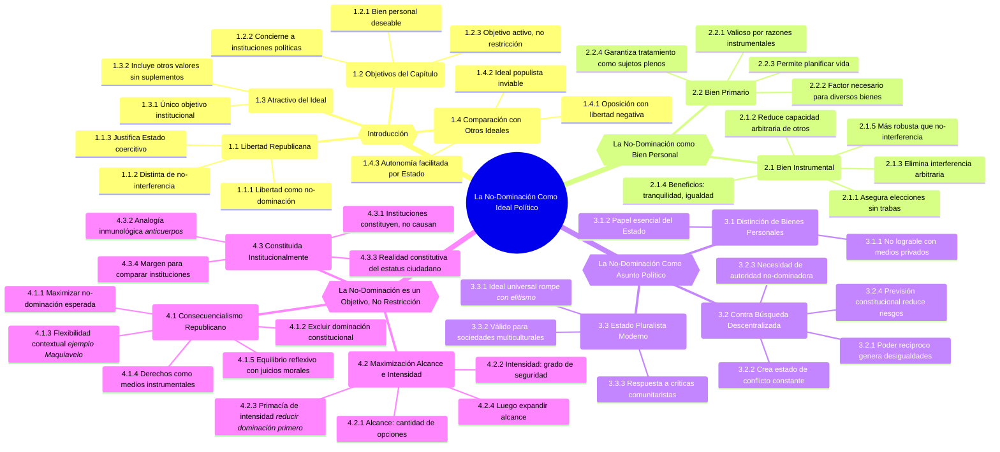

---
tags:
  - Fields_of_Knowledge/Philosophy/Political_Philosophy
  - ☑️
last date: 2025-10-23T21:41
creation date: 2025-05-11T10:56:00
category:
  - "[[Zotero]]"
  - "[[Saberes/Información/Información]]"
  - "[[Saberes]]"
citekey:
  - Pettit_1997_NoDominacionComo
related:
  - "[[El Método/Misiones/Grado en Filosofía/Filosofía Política II/Cuaderno de Filosofía Política II]]"
  - "[[Philip Pettit]]"
---
*Por Marco José Molina Pradillo*

> [!Zotero] 
> **Zotero_Tags** ::  #⭐️⭐️⭐️⭐️⭐️  #Level/5  #Research/FPII  #Status/Consulted  #Status/Read 

>[!Anki]
> **Anki_Deck** :: Fields of Knowledge::Philosophy::Political_Philosophy
> **Anki_Tags** :: Source::Pettit_1997_NoDominacionComo Level::5 Research:: Fields_of_Knowledge::Philosophy::Political_Philosophy
> **Anki_Fields** - MarcoMol | Cloze Study:
Explanation: 
Image: 
LinkText: Pettit, P. (s. f.). La No Dominación como Ideal Político. En _Republicanismo. Una teoría sobre la libertad y el gobierno_. Paidós.
LinkURL: 

> [!Citation] 
> Pettit, P. (s. f.). La No Dominación como Ideal Político. En _Republicanismo. Una teoría sobre la libertad y el gobierno_. Paidós.

^b5946d

>[!Synthesis] 
>**Contribution** :: //////////////////////////////////////////////////////////////////////////////////////////////////////////////// Defensa robusta de la libertad como no-dominación —la condición de estar libre de poder arbitrario— como un ideal político primario que debe ser constituido activamente y maximizado por las instituciones estatales, no meramente respetado como una restricción. ////////////////////////////////////////////////////////////////////////////////////////////////////////////////
>
>**Related** :: 

>[!Metadata] 
> **First_Author** :: Pettit, Philip  
~    
> **Title** :: La No Dominación como Ideal Político  
> **Year** :: 1997   
> **Citekey** :: Pettit_1997_NoDominacionComo  
> **Item_Type** :: bookSection  
> **Book** :: Republicanismo. Una teoría sobre la libertad y el gobierno  
> **Publisher** :: Paidós

> [!Link] 
>
>  [Pettit - La no dominación como ideal político.pdf](file://C:\Users\marco\Zotero\storage\8GB4JPEY\Pettit%20-%20La%20no%20dominación%20como%20ideal%20político.pdf)
>

> [!Abstract]
Pettit defiende la libertad como no-dominación —la condición de vivir sin estar sujeto al poder arbitrario de otros— como el ideal político supremo para un estado moderno. Argumenta que esta concepción de la libertad, central en la tradición republicana, no solo es un bien personal universalmente deseable, sino que también es inherentemente política, requiriendo la promoción activa por parte de las instituciones estatales en lugar de servir meramente como una restricción para ellas.
El argumento procede en tres partes. Primero, establece la no-dominación como un bien primario, demostrando su valor instrumental superior sobre la no-interferencia al proporcionar mayor tranquilidad, igualdad social y protección contra la deferencia estratégica y la subordinación. Segundo, sostiene que la no-dominación no puede alcanzarse mediante medios privados y descentralizados, sino que necesita una autoridad estatal no-dominadora para prevenir una guerra perpetua de todos contra todos y asegurar una protección universal, incluso en sociedades pluralistas. Finalmente, el texto postula que la no-dominación debe entenderse como una meta a maximizar mediante un marco consecuencialista, no apenas como una restricción deontológica. Esto implica priorizar la intensidad de la no-dominación (la seguridad de la libertad) antes que expandir su alcance (el rango de elecciones), todo mientras se reconoce que dicha libertad es constituida institucionalmente por las políticas antes que causalmente creada por ellas. La conclusión es que un Estado legítimamente fundado en este ideal está justificado para usar el poder coercitivo para construir un orden social donde todos los ciudadanos disfruten de un estatus seguro e igualitario, libres del poder arbitrario.
>

***
***
# Schemes
- This section is dedicated to structured visual representations of key concepts, such as flowcharts, diagrams, and mind maps. It helps in analyzing relationships, organizing information hierarchically, and reinforcing memory through visual learning.
***
***
## Mindmap

***
***
# Summary
- Here is a summary in our own words of the most relevant information gleaned from the text. Revising, rewriting and reexplaining the information filtered by ourselves from the written material is the next step to learn from it.
---
---
## «La No Dominación Como Ideal Político» Main Takeaways
### Introducción
- **Libertad en la tradición republicana**:
    1. La no-dominación define la verdadera libertad: vivir entre otros sin estar a merced de nadie.
    2. Se distingue de la libertad como no-interferencia: se puede sufrir interferencias legales sin estar dominado.
    3. La tradición republicana elevó la no-dominación como valor político supremo y justificó al Estado coercitivo siempre que promueva este valor.
- **Objetivos del capítulo**:
    1. Mostrar que la no-dominación es un bien personal universalmente deseable.
    2. Argumentar que concierne inherentemente a las instituciones políticas.
    3. Defender que debe ser un objetivo activo de las instituciones, no solo una restricción.
- **Atractivo del ideal**:
    1. La libertad como no-dominación puede ser el único objetivo de las instituciones.
    2. Su promoción ya incluye valores como bienestar y libertad, sin necesidad de suplementos.
- **Comparación con otros ideales de libertad**:
    1. Se centra en la oposición con la libertad negativa (no interferencia), no con la positiva (autocontrol).
    2. El ideal populista de libertad positiva —participación democrática total— es inviable y poco atractivo.
    3. La autonomía personal debe ser facilitada por un Estado que garantice la no-dominación.
    4. No es necesario comparar directamente sus atractivos, pues la autonomía surge naturalmente bajo instituciones que protegen de la dominación.
### La No-Dominación como Bien Personal
- **Un bien instrumental**:
    1. La no-dominación genera beneficios adicionales frente a la no-interferencia, como un bien intrínseco.
#### Un Bien Instrumental
- **Valor instrumental de la libertad**:
    1. La no-interferencia asegura elecciones sin trabas, aunque no cubre obstáculos naturales.
    2. La no-dominación comparte este valor instrumental, pero lo amplía al reducir la capacidad arbitraria de otros en nuestras vidas.
    3. Ambas ofrecen beneficios prácticos, aunque la no-dominación los complementa con ventajas adicionales.
- **Enfoque de la no-dominación**:
    1. Busca eliminar la interferencia arbitraria y la mera capacidad de ejercerla.
    2. Contrasta con la no-interferencia, que pretende inmunidad frente a cualquier coerción, sea arbitraria o no.
    3. Implica una concepción distinta del derecho: lo no-arbitrario puede ser condición de libertad.
- **Beneficios adicionales de la no-dominación**:
    1. Tranquilidad: libera de la incertidumbre causada por el poder arbitrario, facilitando planificación estable.
    2. Contra el poder arbitrario: reduce la necesidad de deferencia y estrategias anticipatorias frente a los poderosos.
    3. Contra la subordinación: asegura un estatus de igualdad social, evitando la internalización de inferioridad aunque exista no-interferencia formal.
- **Resolución comparativa**:
    1. Aunque la no-interferencia ofrece un espacio de elección irrestricta, la no-dominación es más prometedora en liberar de incertidumbre, dependencia estratégica y subordinación.
    2. Ofrece así un marco de libertad más robusto para la vida en común.
- **Versión restringida de la no-interferencia**:
    1. Sus defensores suelen apoyarse en instituciones no-dominadoras, justificadas por evitar la arbitrariedad.
    2. El derecho puede eliminar incertidumbre y subordinación en espacios regulados, pero tolerar dominación en ámbitos privados y laborales.
#### Un Bien Primario
- **Concepto de bien primario**:
    1. Se trata de algo valioso por razones instrumentales, independientemente de otros fines.
    2. La libertad como no-dominación no sólo es un medio suficiente, sino un factor necesario para lograr diversos bienes.
- **Valor universal de la no-dominación**:
    1. Permite planificar la vida y reduce la incertidumbre.
    2. Evita que las personas caigan en el medro estratégico y la subordinación.
    3. Garantiza ser tratadas como sujetos plenos, con voz y reconocimiento en la vida común.
### La No-dominación Como Asunto de Interés Político
- **Distinción entre bienes personales**:
    1. La amistad es deseada y valorada, pero puede cultivarse eficazmente de manera privada, con escasa necesidad de intervención estatal.
    2. La libertad como no-dominación también es deseada y valorada, pero no puede lograrse plenamente mediante medios privados descentralizados.
    3. El Estado tiene un papel esencial para promover eficazmente la libertad, haciéndola un asunto de interés político.
#### Contra la Búsqueda Descentralizada de No-dominación
- **Desventajas de la estrategia de poder recíproco**:
    1. La no-dominación dejada a los individuos conduce a desigualdades extremas, acumulando poder y recursos en manos de los más fuertes.
    2. La reciprocidad de poderes genera un estado de conflicto constante, similar a una guerra civil permanente, limitando gravemente las opciones no-dominadas.
    3. Los factores condicionantes y comprometedores de la libertad son más graves bajo esta estrategia, dependiente de amenazas disuasorias y autoprotección mutua.
- **Necesidad de una autoridad no-dominadora**:
    1. Un encargado de promover la no-dominación debe limitar ciertas opciones o encarecer algunas elecciones para garantizar protección efectiva.
    2. El sistema de derecho y gobierno introduce coerciones para mantener un marco de opciones accesibles sin dominación arbitraria.
- **Comparación con previsión constitucional**:
    1. Aunque limita algunas opciones, la previsión constitucional reduce los riesgos de la estrategia de poder recíproco.
    2. Permite confiar parcialmente en mecanismos de poder recíproco dentro de un marco regulado, como ocurre con el sindicalismo.
    3. Conclusión: la libertad como no-dominación no puede dejarse descentralizada y debe ser promovida mediante la previsión constitucional.
#### La No-dominación y el Estado Pluralista Moderno
- **De elitismo a inclusión**:
    1. La tradición republicana limitaba la no-dominación a élites propietarias.
    2. La propuesta moderna rompe con ese elitismo y asume que todos los seres humanos son iguales, por lo que el ideal debe ser válido universalmente.
    3. La no-dominación se presenta como ideal supremo del Estado, apto para sociedades multiculturales y desarrolladas.
- **Críticas comunitaristas**:
    1. Alegan que la no-dominación no es tan neutral y carece de fuerza motivacional en contextos de diversidad cultural, racial o religiosa.
    2. Respuesta republicana: este escepticismo proviene de desesperanza e ignorancia, pues en sociedades pluralistas el anhelo de no ser dominado es común y vivamente sentido.
- **Sobre la fragilidad del ideal**:
    1. Se objeta que la no-dominación es demasiado tenue para orientar instituciones políticas de forma eficaz.
    2. Aun si resulta imposible sostener un ideal político neutral de alcance universal, debe intentarse antes de abandonar el esfuerzo.
### La No-dominación es un Objetivo, No una Restricción
- **Dos formas de entender el valor de la no-dominación**:
    1. Como objetivo: el Estado debe promoverla activamente y maximizar su realización esperada.
    2. Como restricción: el Estado debe respetarla y dar testimonio de su importancia, incluso si no se maximiza.
#### Consecuencialismo y No-consecuencialismo
- **Ejemplo de Bertrand Russell**:
    1. Durante la Primera Guerra Mundial defendió la paz como restricción absoluta a la acción estatal.
    2. En la Segunda Guerra Mundial justificó la lucha contra Hitler desde una perspectiva consecuencialista: preservar la paz futura requería intervención.
- **Libertad como no-interferencia**:
    1. En la versión consecuencialista, instituciones válidas son las que maximizan la no-interferencia efectiva.
    2. En la versión deontológica, se prioriza respetar derechos naturales de no interferencia, lo que limita severamente al Estado y lo acerca al anarquismo o, en su versión más moderada, a un Estado mínimo (Nozick).
- **Libertad como no-dominación**:
    1. Puede concebirse tanto como objetivo a promover como como restricción al diseño institucional.
    2. Un Estado legítimo debe maximizar la no-dominación esperada y, al mismo tiempo, excluir cualquier trazo de dominación en su orden constitucional.
#### El Consecuencialismo Republicano
- **Actitud de la tradición republicana**:
    1. No hay citas expresas sobre la no-dominación como objetivo o restricción.
    2. La tradición muestra un sesgo teleológico: los pensadores debatían empíricamente qué instituciones mejor promueven la libertad.
    3. Este carácter abierto indica que la no-dominación era entendida como un bien a promover mediante los medios más eficaces, según el contexto.
- **Ejemplo de Maquiavelo**:
    1. Reconocía que, en sociedades corruptas, quizá la mejor forma de preservar la libertad fuese dar amplios poderes a un príncipe.
    2. Esto ilustra la flexibilidad teleológica de la tradición.
- **Apariencia de deontología**:
    1. El republicanismo se entretejió con hábitos iusnaturalistas y jurisprudenciales, lo que le daba un tinte deontológico.
    2. Ejemplo: *Comentarios de las leyes de Inglaterra* (Blackstone), *Federalist Papers*.
    3. Pero, en realidad, los derechos se concebían como medios instrumentales para la no-dominación, no como normas inviolables.
- **Orientación teleológica**:
    1. Si maximizar la no-dominación requiere desviaciones de una constitución perfecta, deben tolerarse.
    2. Aferrarse al ideal abstracto sería un fetichismo.
- **Equilibrio reflexivo**:
    1. Si promover la no-dominación implicara instituciones moralmente repulsivas, habría que reconsiderar el ideal.
    2. El propósito de la teoría política es encontrar un ideal que armonice con nuestros juicios morales y guíe su aplicación a nuevos casos.
    3. La libertad como no-dominación pasa esta prueba: puede sostenerse teleológicamente sin exigir estrategias intuitivamente objetables.
#### La Maximización del Alcance y de la Intensidad
- **Dos dimensiones de la libertad**:
    1. Alcance = cantidad de opciones no dominadas.  
    2. Intensidad = grado de seguridad con que se disfrutan esas opciones.  
    3. Problema: ¿pueden integrarse en un único objetivo estatal, o hay que elegir entre ambos?
- **Indeterminación inicial**:
    1. Existen diferentes combinaciones de alcance e intensidad igualmente valiosas.  
    2. Esta indeterminación parece chocar con la intuición básica de que la dominación es un mal claro y debe erradicarse sin ambigüedad.  
- **Primer tipo de indeterminación**:
    1. En la práctica, la reducción de dominación en un ámbito suele reforzar la reducción en otros.  
    2. Ejemplo: proteger contra robos también protege contra agresiones.  
    3. El Estado puede intensificar la no-dominación en varios frentes a la vez.  
    4. **Modelos de Estado**:
        - *Restrictivo*: limita más las opciones, pero ofrece mayor intensidad de no-dominación.  
        - *Permisivo*: más opciones, pero menor intensidad.  
        - *Expansivo*: amplía opciones en nuevos ámbitos (ejemplo: accesibilidad para discapacitados).  
- **Segundo tipo de indeterminación**:
    1. Se puede optar entre mayor intensidad con menos alcance o menor intensidad con mayor alcance.  
    2. Esta tensión se reduce porque la protección eficaz tiene límites:  
        - Más allá de cierto punto, el Estado mismo se convierte en dominador (ejército, policía, inteligencia).  
    3. Sistemas jurídicos demasiado restrictivos aumentan la amenaza de dominación estatal, por lo que resultan poco atractivos.  
    4. Normalmente no hay que elegir entre proteger mejor y expandir opciones: ambas dimensiones se refuerzan mutuamente.
- **Primacía de la intensidad**:
    1. El objetivo principal del Estado = incrementar la intensidad de la no-dominación.  
    2. Una vez asegurada, se busca expandir el alcance de opciones no dominadas.  
    3. Entre dos Estados igual de intensos, se prefiere el que ofrezca más alcance.  
- **Predisposición natural republicana**:
    1. Esta jerarquía refleja bien la intuición de partida: la dominación es el mal a erradicar.  
    2. Es natural priorizar la reducción de dominación real en los ámbitos amenazados antes que multiplicar opciones.  
    3. Los criterios republicanos tienden a armonizar con las instituciones políticas recibidas y con nuestra intuición moral básica.  
#### La No-dominación Está Constituida Institucionalmente, No Está Causada
- **Un extremo clave**:
    1. El hecho de que la república esté diseñada para promover la no-dominación no implica que las instituciones la causen.  
    2. Más bien, la constituyen: la no-dominación existe en tanto que esas instituciones distribuyen poder y protección.
- **Instituciones perfectas**:
    1. En un marco ideal, todos gozan de un estatus perfectamente no-dominado.  
        - Nadie está sujeto a interferencia arbitraria.  
        - Toda interferencia posible es no arbitraria.  
    2. Las instituciones interfieren causalmente en la vida social (leyes, sanciones, regulaciones).  
    3. Pero la no-dominación que generan no es un efecto causal: ya se da desde el momento en que esas instituciones existen y nos sitúan fuera del alcance de la arbitrariedad.  
    4. La conciencia social de la no-dominación llega después, pero no es condición para que esta exista.
- **Analogía inmunológica**:
    1. Así como la presencia de anticuerpos *constituye* la inmunidad (no la causa).  
    2. La existencia de instituciones capacitadoras y protectoras *constituye* la no-dominación frente a la interferencia arbitraria.
- **Libertad y ciudadanía**:
    1. Montesquieu: la libertad se halla tanto en la constitución como en el ciudadano.  
    2. Ser libre = ser ciudadano de una comunidad donde todos están protegidos contra interferencia arbitraria.  
    3. Esa libertad es constitutiva, no un efecto causal de las instituciones. 
- **La no-dominación como realidad institucional**:
    1. Objeción: si la libertad está constituida por el Estado, ¿cómo juzgar al propio Estado?  
    2. Respuesta: la libertad no se define por un tipo concreto de institución (ej. democracia directa, gobiernos locales).  
    3. Se define por el grado de protección frente a la interferencia arbitraria.  
    4. Aunque solo pueda lograrse institucionalmente, hay margen para comparar conjuntos distintos de instituciones según cómo promuevan la no-dominación.  

---
## Connections

1. Relación con la servidumbre forzada de los desposeídos y la sumisión interesada ante los poderosos. [[@Pettit_1997_NoDominacionComo#^8b92bc|🔗]]
2. Relación entre ser tratado como persona con voz y dignidad y la imposibilidad de ello bajo dominación. [[@Pettit_1997_NoDominacionComo#^55d464|🔗]]
3. Reflexión histórica sobre las consecuencias de dejar la no-dominación en manos de los individuos y el abuso de poder. [[@Pettit_1997_NoDominacionComo#^25cb34|🔗]]

---
## Curiosities & Comments

1. Reflexión sobre mundos posibles frente al mundo real y la conexión con la Reología política. [[@Pettit_1997_NoDominacionComo#^ab05a4|🔗]]
2. Ejemplo histórico de Bertrand Russell para ilustrar la diferencia entre entender un valor como restricción o como objetivo. [[@Pettit_1997_NoDominacionComo#^34b6b3|🔗]]
3. Maquiavelo sugería que, en sociedades corruptas, la no-dominación podía preservarse mejor con un príncipe fuerte, incluso con poderes casi absolutos. [[@Pettit_1997_NoDominacionComo#^6b8a14|🔗]]

---
## Definitions

1. [[@Pettit_1997_NoDominacionComo#^a59b9b|Republicanismo consecuencialista]]
2. [[@Pettit_1997_NoDominacionComo#^45fdfa|Bien primario]]

---
## Questions

1. Note the questions that the paper inspired.

***
***
# Annotations
- This section contains self-made highlights, underlined passages, and marginal notes from the text. Reading through the text, capturing key insights, important details, and reflections to reinforce understanding and facilitate a summarized review is the first step when learning from written material.
***
***
## La No-Dominación Como Ideal Político
### Introducción
- La libertad en la tradición republicana...
    1. El punto focal es la no-dominación: la condición en que viven ustedes cuando están en presencia de otros, pero a merced de ninguno.
    - La no-dominación...
        1. La libertad como no-dominación.
        2. Distinta de la idea, ahora preponderante, de libertad como no-interferencia.
            1. Ustedes pueden padecer la interferencia de alguna agencia, como en el caso de la sujeción a una forma adecuada de derecho y de gobierno, sin ser dominados por nadie.
    - La tradición republicana...
        1. Asignó a la libertad como no-dominación el papel de valor político supremo.
        2. Justificación de un estado coercitivo y potencialmente dominante.
            1. Propiamente constituido, es un régimen que sirve a la promoción de ese valor.
- Este capítulo...
    1. Por qué la libertad como no-dominación es un bien personal que prácticamente todos tienen razones para desear.
    2. Es algo que inherentemente concierne a las instituciones políticas.
        1. La no-dominación es un objetivo que esa sinstituciones deberían tratar de promover, no una restricción.

> [!Definition]
>- Versión consecuencialista del republicanismo...
>*En el contexto del <b>republicanismo</b>, una <b>versión consecuencialista</b> se centra en los <b>resultados o consecuencias</b> de las acciones y políticas. A diferencia de las perspectivas puramente formales o procedimentales, que se enfocan en los procesos y las estructuras, el enfoque consecuencialista considera los <b>efectos prácticos</b> de las decisiones políticas. En el caso específico del <b>republicanismo consecuencialista</b>, se evalúan las instituciones y políticas gubernamentales en función de su capacidad para <b>promover la no dominación</b> y garantizar la libertad de los ciudadanos. Esto implica analizar cómo las políticas afectan la capacidad de las personas para actuar sin estar sujetas a la arbitrariedad o el poder injustificado de otros. En resumen, el republicanismo consecuencialista busca maximizar la <b>libertad real</b> y la <b>ausencia de dominación</b> a través de políticas y acciones que tengan resultados positivos en términos de empoderamiento y autonomía de los ciudadanos.*

^a59b9b

- La libertad como no-dominación...
	1. Puede ser el único objetivo de que deben preocuparse nuestras instituciones, es muy atractivo.
	- Atractivo...
	    1. La libertad como no-dominación no necesita suplemento.
	    2. Exige ya de entrada a las instituciones que se compadezcan bien con valores como la libertad y el bienestar.
- Comparar la libertad como no-dominación y la libertad positiva al modo populista...
    1. Me limitaré a compararla con el ideal negativo de la libertad como no interferencia, no con el ideal positivo del autocontrol.
    - Libertad positiva al modo populista...
        1. Participación democrática.
            1. Este ideal participativo es inviable en el mundo moderno.
        2. La perspectiva de que todos estén sometidos a la voluntad de todos no resulta muy atractiva..
	- La libertad como autonomía personal...
	    1. La libertad como autocontrol personal debería ser facilitada, si no activamente promovida, por un estado que garantizara la libertad como no-dominación.
	    2. No sería, pues, un ejercicio útil comparar los atractivos de ambas libertades.
	    3. Se puede confiar en la capacidad de la gente para procurar por su propia autonomía, una vez se les garantiza la vida bajo un ordenamiento que les protege de la dominación de otros.
### La No-Dominación como Bien Personal
- Un bien Instrumental...
    1. En contraste con el otro tipo de libertad, sale mejor parada en varios respectos.
        1. Capaz de generar otros beneficios al individuo que la disfruta.
    2. Nada que objetar a quien sostenga que la libertad como no-dominación es un bien intrínseco.
#### Un Bien Instrumental
- Beneficio instrumental que asociamos al disfrute de la no interferencia...
    1. El beneficio de no ver estorbadas o inhibidas por otros nuestras elecciones.
    2. Si nuestra no-interferencia real es maximizada, tenemos asegurado el máximo disfrute posible de ese beneficio.
    3. Los devotos de la no-interferencia buscan una esfera de acción individual a salvo de cualquier coerción real o esperada.
    - Obstáculos naturales...
        1. La ausencia de obstáculos naturales no es un beneficio que se siga instrumentalmente del disfrute de la no-interferencia.
            1. Pueden disfrutar de la más perfecta no-interferencia en presencia de esos obstáculos.
        2. La conexión con la reducción de los obstáculos naturales está ya incorporada en el valor independiente, instrumental, de la no-interferencia.
            1. No es parte de lo que hace a la no-interferencia valiosa.
    - Lo mismo vale para la libertad como no-dominación, pero tiene ventajas...
        1. El proyecto de promover la no-dominación entraña naturalmente tanto la promoción de la intensidad de la no-dominación cuanto expandir el ámbito de las opciones no-dominadas.
        2. El supuesto de que la no-dominación es un valor instrumental tiene que defenderse independientemente de los efectos que traiga consigo la expansión del ámbito de opciones no-dominadas.
            1. Proporciona el mismo beneficio instrumental en una medida un tanto inferior, pero que compensa.
        3. Ofreciendo tres beneficios adicionales.
- La libertad como no-dominación promete...
    1. Sólo la exención de interferencia intencional arbitrariamente fundada: específicamente, la erradicación de la capacidad ajena para la interferencia arbitraria.
    2. Si los devotos de la no-interferencia buscan una esfera de acción individual a salvo de cualquier coerción real o esperada, los devotos de la no-dominación buscan una esfera de acción a salvo sólo de la coerción —o de la capacidad de coerción— procedente de direcciones arbitrarias.
- Distintas concepciones del derecho...
    1. El primer grupo pone todo sistema jurídico en el lado de las cosas que comprometen la libertad.
    2. El segundo grupo sostiene que una forma de derecho adecuadamente no-arbitraria cae del lado de los condicionamientos de la libertad.

> [!Connection]
>*Cuanta razón... Me vienen a la mente tanto la forzada servidumbre de los que no tienen nada como el ejemplo concreto del lameculos de Milei con los multimillonarios y poderosos*

^8b92bc

- Beneficios adicionales...
    - El primero: La Tranquilidad...
        1. La interferencia arbitraria es notoriamente peor que la no-arbitraria.
            1. No puede predecirse cuándo nos va a acometer.
        2. Esa incertidumbre hace mucho más difícil la planificación que en el caso de la interferencia no-arbitraria.
	    - Libertad como no-dominación...
	        1. La libertad como no-dominación nos exige reducir las capacidades de interferencia arbitraria a que una persona está expuesta, en tanto que la libertad como no-interferencia nos exige minimizar las expectativas de interferencia de la persona en cuestión.
	    - Máxima no-interferencia...
	        1. Es muy posible que la máxima no-interferencia factible para alguien pueda lograrse bajo un ordenamiento en el que la persona esté obligada a sufrir mucha incertidumbre.
			- Nivel global...
				1. En el nivel global o agregado, no tomamos cautelas respecto de la interferencia de los más poderosos.
				2. La maximización global de la no-interferencia es perfectamente compatible con obligar al trabajador o a la mujer a vivir en la más completa incertidumbre.
			- Nivel individual...
			    1. También en el nivel individual..
			    2. Quizá la vía para maximizar la no-interferencia esperada de la persona es dejarla sometida a otros, y por consiguiente, en una situación de mucha incertidumbre.
			1. Promoviendo la libertad como no-dominación de alguien, eliminaremos el espectro de esa incertidumbre.
		    2. Es posible que la persona tenga que vivir bajo el imperio permanente de una constitución y de un derecho, un imperio que introducirá un tanto de coerción en su vida.
			    1. Pero no tendrá que vivir bajo el constante temor de la interferencia impredecible, pudiendo así al menos organizar sus asuntos de manera sistemática y con una buena dosis de tranquilidad.
	- El segundo: Contra el ejercicio del poder arbitrario...
	    1. Sufrir la realidad o la expectativa de interferencia arbitraria es tener también que mirar con el rabillo del ojo a los poderosos.
		    1. Anticipar qué esperan ellos de ustedes para tratar de complacerles.
		    2. Anticipar los movimientos de ellos para no atravesarse en su camino.
		- Libertad como no-dominación...
		    1. Significa reducir las capacidades que otras gentes puedan tener para interferir en su vida.
			    1. Reducirá la necesidad de deferencia o anticipación estratégica.
			    2. Reducirá también el grado de incertidumbre.
		- Libertad como no-interferencia...
		    1. No garantiza ese efecto.
		    2. Muy bien podría ser que el mejor modo de maximizar la expectativa de no-interferencia de alguien consistiera en buena medida en confiar en el ingenio, forzándole a desarrollar y a ejecutar estrategias apaciguadoras y anticipadoras frente a los poderosos.
		    3. Practicar la deferencia y la anticipación estratégicas, vivir en la incertidumbre exige del agente la mutilación de las propias elecciones.
			    1. Forzada negación de sí mismo.
			    2. Para que haya interferencia tiene que haber sido perpetrada intencionalmente por otro.
		- La vida libre...
		    1. Ideal de libertad como no dominación.
		    2. Perseguir la reducción de las capacidades ajenas de interferencia arbitraria.
			    1. La necesidad de esas estrategias queda reducida a sus mínimos.
	- El tercer beneficio: Contra la Subordinación...
		- Libertad como no-dominación...
		    1. El disfrute de la libertad como no-dominación trae consigo la posibilidad de verse a uno mismo no-vulnerable.
		    2. En posesión de un estatus social a la par del otro.
		- Libertad como no-interferencia...
		    1. Aun si las dos partes disfrutan de igual no-interferencia, y hasta de igual no-interferencia esperada, muy probablemente desarrollarán una consciencia compartida de la asimetría del poder.
			    1. Consciencia compartida, además, con otros miembros de la comunidad.
		    2. Ver una opción como una elección improbable del agente, aunque sea todo lo improbable que se quiera, es cosa distinta de verla como una elección inaccesible al agente.
			    1. Hace muy expedito el camino para que yo me vea forzado a pensar en mí mismo como en una persona subordinada a otra.
		    3. Es posible disfrutar del más elevado grado de no-interferencia posible en una situación en la que ustedes están subordinados a otro.
	    1. Cualquier incremento de no-dominación significa, en cambio, un decremento de la subordinación aque están ustedes expuestos.
- En resolución...
    1. La libertad como no-dominación puede parecer un peor servicio a la elección irrestricta que la libertad como no-interferencia.
	    1. Se opone sólo a la interferencia arbitraria.
    2. Mas la libertad como no-dominación se deja comparar con mucha ventaja en tres otros respectos de la mayor importancia.
	    1. Más prometedora en punto a liberar a las personas de la incertidumbre, y de la ansiedad y la incapacidad para planificar que ésta acarrea.
	    2. Liberarlas de la necesidad de tener que desplegar estrategias con los poderosos.
	    3. Liberarles de la subordinación que acompaña a la consciencia común de que la persona en cuestión está expuesta a la posibilidad de interferencia arbitraria ajena.
- Versión restringida del ideal de no-interferencia...
	1. Quienes abrazan la libertad como no-interferencia a menudo dan por sentado que la mejor forma de promoverlo es sirviéndose de las instituciones tradicionales, no-dominadoras.
	    1. La justificación más obvia de las cuales es el deseo de evitar la arbitrariedad.
	- El imperio de un derecho...
	    1. La incertidumbre, el medro estratégico y la subordinación son eliminados en el ámbito en el que las relaciones entre las gentes están estructuradas por los requerimientos judiciales oportunos.
	    2. Pero es compatible con la tolerancia de la dominación en los ámbitos en los que los requerimientos judiciales oportunos abandonan a las gentes a su propia suerte.
		    1. Lugar de trabajo.
		    2. Espacios privados.
#### Un Bien Primario

> [!Definition]
> - **Bien primario**...
>     1. Algo deseable por razones instrumentales, deséese por lo demás lo que se quiera: algo que promete resultados que muy probablemente serán atractivos, valórese y persígase lo que se quiera.

^45fdfa

- **Un bien primario**...
    1. La libertad como no-dominación no sólo parece un instrumento más o menos suficiente para conseguir esos efectos, sino un factor necesariamente involucrado en su logro.
    2. Va en las dos direcciones.

> [!Curiosity]
> - Mundos posibles y Mundo real...
> 	1. Tal vez no valga esto en todos los mundos posibles, pero desde luego parece valer para el modo de funcionamiento del mundo real.
> 	2. Me ha recordado a la Reología política.

^ab05a4

- **La libertad como no-dominación es un Bien primario**...
     1. La persecución de casi todas las cosas que una persona puede valorar se verá facilitada por su capacidad para poder hacer planes.
     2. En la medida en que entraña una reducción de incertidumbre, la no-dominación posee el firme atractivo de un bien primario.
     3. Toda persona tiene razones para desear la libertad como  no-dominación; a falta de esa libertad, se convertirían en criaturas  forzadas al medro estratégico y a la subordinación, sin esperanza de ser  propiamente tratadas como personas.

> [!Connection]
> - Ser tratado propiamente como persona...
> 	1. Ser una persona es ser una voz que no puede ser propiamente ignorada, una voz que habla sobre asuntos cuyo interés le ha sido despertado en común con otros, y que habla sobre ellos con cierta autoridad: desde luego con la autoridad suficiente para dar qué pensar a quienes discrepan de ella.
>     2. Es ser tratado como una voz que no puede ser preterida, sin razones independientes de por medio: es ser tomado como alguien digno de ser escuchado. La condición de dominación, en la medida en que va ligada a la necesidad de medro estratégico y subordinación, reduce la probabilidad de que alguien sea tratado como persona de esta forma.
> - *Esto se enfrenta a lo que decía Rafa, mi compañero de piso Israelí:*
> 	- *"Los Palestinos están radicalizados, no se puede dialogar con ellos"*.

^55d464

### La No-dominación Como Asunto de Interés Político
- **La amistad**...
    1. Algo que todos pretendemos y valoramos.
    2. La mayoría de nosotros podemos cultivarla bastante eficazmente por nosotros mismos y difícilmente el Estado lo haría mejor.
- **La libertad**...
    1. Un bien que la mayoría de nosotros pretende y valora.
    2. Pero se trata de un bien que los individuos no pueden perseguir sirviéndose de medios privados descentralizados.
	    1. Es un bien que el Estado puede promover bastante eficientemente.
#### Contra la Búsqueda Descentralizada de No-dominación

> [!Connection]
> - *Precisamente... La historia de la humanidad.*

^25cb34

- **Desventaja de la estrategia del poder recíproco en relación con la estrategia alternativa de la previsión constitucional**...
	- **Distribución muy desigual de la no-dominación**...
	    1. Abandonar la no-dominación al cuidado de los individuos llevaría a una distribución muy desigual de la no-dominación.
	    2. Supongamos que la gente persiguiera su propia no-dominación.
	        1. Defenderse a sí mismos de la interferencia ajena, de castigar cualquier interferencia.
	    3. Una dirección nada deseable.
	        1. Las desigualdades de fortaleza, influencia social, localización geográfica... No pueden sino acumularse.
	        2. Los más fuertes se sirven de su posición y más recursos, haciéndose así más y más fuertes.
	    4. Resultado inevitable de dejar en manos de los individuos la persecución descentralizada de su propia no-dominación sería que la mayoría de ellos se hallarían al final a merced, ya de esta persona o de este grupo más fuerte, ya de estos otros.
		- **La reciprocidad de poderes**...
		    1. Idealmente, todos consiguen la no-dominación.
			    1. Gracias a la posesión de recursos suficientes para garantizar que cualquier acto de interferencia ajena será resistido.
		    2. Pero el cuadro es muy parecido al de la guerra civil permanente.
			3. El abanico de opciones no-dominadas quedaría brutalmente mutilado.
			    1. Las opciones restantes, gravemente entorpecidas.
	- **Un encargado de promover la no-dominación por medios no-dominadores**...
	    1. Aunque una autoridad constitucional no dominará a la gente, debe invariablemente limitar las opciones de ésta, o hacer que sus elecciones resulten más costosas.
		- **Sistema de derecho y de gobierno**...
		    1. Ciertas opciones dejan de ser accesibles a los agentes.
		    2. Presiones coercitivas en el empeño de eliminar un buen número de opciones.
			    1. La fiscalidad hará que varias opciones resulten más costosas.
- **Factores que comprometen/condicionan la libertad**...
	1. En términos de factores que comprometen y factores que condicionan la libertad.
		1. En ambas estrategias, la libertad de la gente queda seriamente condicionada.
	2. La desventaja relativa de la estrategia del poder recíproco es que tiene efectos condicionantes mucho más graves.
	- **Supuesto irrealista**...
	    1. En una situación de este tipo, es inevitable que la gente dependa del valor disuasorio de la amenaza con represalias.
		    1. La gente acabará interfiriéndose mutuamente de manera arbitraria.
	    2. Lo más que puede conseguirse con una estrategia de poder recíproco es un equilibrio disuasorio, no un equilibrio defensivo.
		    1. Todos los inconvenientes del estado de naturaleza.
	- **Hobbes**...
	    1. Si todos buscan protegerse de la interferencia ajena, en particular con ataques preventivos, el resultado será una guerra de todos contra todos.
	    2. Todos prefieren una estrategia de autoprotección a una de desarme unilateral.
		    1. Pero si todos siguen una estrategia de autoprotección, todos estarán peor.
- **La opción más atractiva**...
    3. Los efectos de la previsión constitucional no son comparables con las desventajas del poder recíproco limita las opciones disponibles de la gente, pero con menos desventajas que la estrategia del poder recíproco.
	    1. En el marco de un estado constitucional, puede incluso confiarse en la estrategia de los poderes recíprocos.
		2. El movimiento sindicalista es un ejemplo.
    4. La libertad como no-dominación no puede dejarse en manos de los individuos de forma descentralizada.
	    1. Además la estrategia de los poderes recíprocos augura demasiados problemas.
    5. La lección: explorar la estrategia alternativa, más prometedora, de confiar en la previsión constitucional.
#### La No-dominación y el Estado Pluralista Moderno
- **Los pensadores de tradición republicana**...
    1. Eran tácitamente de la opinión de que la libertad como no-dominación resultaba factible en un sistema político sólo para una élite de propietarios.
        1. Habrá que romper con ese elitismo.
	- **Nueva propuesta republicana**...
	    1. Una clase de republicanismo característicamente moderna e incluyente supone:
	        1. Todos los seres humanos son iguales y cualquier ideal político plausible debe serlo para todos.
	        2. Adoptar la no-dominación como ideal supremo del estado.
	    2. Motivada por el supuesto de que el ideal puede ganar la adhesión de ciudadanos de sociedades desarrolladas y multiculturales, con independencia de sus concepciones particulares del bien.
- **Los comunitaristas contra este supuesto**...
	1. El ideal de no-dominación no es tan neutral como parece.
		1. Neutral o no, no es capaz de motivar a la gente de un modo que trascienda divisiones de raza, religión o género.
	- **Respuesta**...
	1. Consejo nacido de la desesperanza.
		1. No hay posibilidad de adhesión moralmente motivada a ninguna política fuera de una comunidad lo bastante homogénea.
	2. Un consejo procedente de la ignorancia.
		1. Eso conlleva la amputación de un anhelo humano.
			1. Quien viva inmerso en la sociedad pluralista contemporánea debe apreciar vivamente el ideal de no ser dominado por otro.
- **¿Lumbre demasiado tenue?**...
	1. Se dirá que un ideal universalmente reconocido de no-dominación es una lumbre demasiado tenue para orientar la política.
	    1. La remodelación motivacionalmente eficiente de las instituciones compartidas precisa de faros menos neutrales, más arraigados culturalmente.
	    2. Puede que al final resulte imposible hallar un ideal político neutral capaz de atraerse la adhesión.
    2. Dejemos entonces que la imposibilidad se muestre después de hecho el esfuerzo.
### La No-dominación es un Objetivo, No una Restricción
- **Supuesto que la no-dominación es, en efecto, un valor**...
    1. ¿Cómo tendría ese valor que contribuir a la modelación del sistema?
	- **Dos posibilidades**...
	    1. La primera: que el estado se sirva del valor, bien o ideal, como objetivo a promover.
	    2. La segunda: que ese valor sirva él mismo como restricción a la promoción estatal de otros bienes.
#### Consecuencialismo y No-consecuencialismo

> [!Curiosity]
> - Bertrand Russell...
> 	1. Encarcelado, como muchos otros, durante la primera guerra mundial por albergar ideas pacifistas. Sostuvo vigorosamente que el valor de la paz exigía de los aliados retirarse de aquel conflicto repugnante e inútil.
> 		1. Pero entre Bertrand Russell y algunos de sus amigos pacifistas había una diferencia que sólo se puso de manifiesto en el transcurso de la segunda guerra mundial.
> 	2. Mientras sus amigos siguieron adoptando una actitud pacifista en 1939, oponiéndose a la entrada de los aliados en la guerra, Russell fue de la opinión de que esta guerra estaba justificada.
> 		1. Justificación: la causa de la paz quedaba comprometida para siempre en caso de que Hitler no encontrara oposición.
> 	3. Sus amigos entendían el valor de la paz como una restricción puesta a la conducta del estado. Russell mantenía una posición consecuencialista respecto del valor de la paz.

^34b6b3

- **Un bien será un objetivo para un agente o para una agencia**...
    1. Si y sólo si su tarea es promover ese bien.
    2. El objetivo consistirá en maximizar su realización esperada.
- **Un bien será una restricción para un agente o para una agencia**...
    1. Si y sólo si su tarea no pasa necesariamente por promoverlo, pero sí por guardar testimonio de su importancia y respetarlo.
- **Libertad como no-interferencia**...
    - **Como objetivo: La respuesta consecuencialista o teleológica**...
        1. Instituciones políticamente adecuadas: instituciones que mejor promuevan esa libertad.
            1. Aquellas instituciones cuya presencia signifique que en la sociedad se disfruta de más no-interferencia de la que se disfrutaría en caso contrario.
	- **Como restricción: La versión deontológica del liberalismo**...
		1. El estado mismo es una fuente de interferencias, pues las leyes son necesariamente coercitivas.
				1. El estado constituye una amenaza para el valor de no-interferencia.
		2. De lo que se trata no es de promover globalmente la no-interferencia tanto como sea posible, sino de respetar los derechos supuestamente naturales y fundamentales de la gente a no ser interferida en su vida.
		3. Liberalismo deontológico.
			1. Plantea la cuestión de si puede llegar a haber un estado legítimo; parecería hacer del anarquismo la única opción.
			2. Robert Nozick (1974)
		- **Un estado mínimo**...
			1. Un estado que se limita a cumplir funciones de guardián nocturno en el mantenimiento del orden interior y de la defensa exterior.
- **Libertad como no-dominación**...
    - **Bien como un objetivo, bien como restricción**...
        1. El estado debería ser diseñado de tal modo que la libertad como no-dominación esperada de quienes viven bajo el sistema llegara a su punto máximo, como en un mundo idealmente dócil
        2. Debería ser diseñado de tal modo que, sea o no maximizada la libertad como no-dominación esperada, el sistema respetara sin asomo de ambigüedad el valor de la no-dominación, sin el menor tinte de dominación en el ordenamiento constitucional.
#### El Consecuencialismo Republicano
- **¿Cuál fue la actitud de la tradición republicana respecto de la no-dominación?**...
    1. No es posible hallar citas expresas sobre este asunto.
    2. Hay un aspecto de la tradición que sugiere una perspectiva fundamentalmente teleológica.
        1. Casi todas las grandes figuras están enfrentadas en la cuestión de qué instituciones son mejores para la libertad.
        2. La plantean como cuestión empírica abierta.
    - **Una cuestión abierta**...
	    1. No se plantearía como una cuestión abierta en un enfoque deontológico.
	        1. Significaría comportarse siempre de la misma forma, independientemente del contexto.
	    2. El supuesto de que la cuestión es una cuestión abierta a carácter empírico revela seguramente una concepción de la no-dominación como objetivo a promover por el estado sirviéndose de los medios que resulten empíricamente más eficaces, cualesquiera que sean.
		3. Aun siendo dogmáticos estos maestros nunca dejaron de ofrecer razones empíricas para sus preferencias.

> [!Curiosity]
> - Maquiavelo...
> 	1. Maquiavelo está dispuesto a conceder, por ejemplo, que cuando las personas son ya corruptas, e incapaces de aguantar una forma adecuada de derecho, es posible que el mejor modo de promover la libertad como no-dominación sea investir a un príncipe con poderes poco menos que absolutos.

^6b8a14

- **Una palabra de cautela**...
	1. La perspectiva republicana venía entretejida, en la tradición de los hombres de la commonwealth, con hábitos intelectuales jurisprudenciales e iusnaturalistas.
		1. Le daba un aspecto deontológico.
	2. Influencia clara en varios documentos posteriores.
		1. Los *Comentarios de las leyes de Inglaterra* de William Blackstone.
		2. *Federalist Papers*.
	- **No obstante**...
		1. Cuando los republicanos hablaban de derechos naturales, generalmente trataban de sostener que determinados derechos resultaban medios esenciales para lograr la libertad como no-dominación.
		2. No implicaba que los derechos fueran normas fundamentales.
- **La mejor orientación: La teleológica...**
    1. Si la causa de la maximización de la no-dominación exige tales desviaciones respecto de una constitución perfecta tendría que resultar lo más natural del mundo la tolerancia de esas desviaciones; sería un preciosismo, un fetichismo incluso, insistir en la fidelidad al ideal abstracto.
- **La salvedad del equilibrio reflexivo**...
	1. Si la promoción de la no-dominación exigiera el recurso a ordenamientos y a estrategias institucionales que se revelaran intuitivamente repulsivas para nuestros sentimientos morales, entonces tendríamos que preguntarnos si la no-dominación resulta, después de todo, un ideal político realmente adecuado.
	2. O si tal vez la política realmente adecuada sea respetar el ideal, más que la de promoverlo.
	- **El propósito de la teoría política**...
		1. Hallar un ideal que se revele, tras la debida reflexión capaz de conseguir un equilibrio con nuestros juicios acerca de las respuestas políticas apropiadas y capaz de contribuir a la extrapolación de esos juicios a casos nuevos.
		2. Un republicanismo teleológico dejaría de satisfacer el equilibrio reflexivo si exigiera ordenamientos intuitivamente objetables.
			1. La libertad como no-dominación del republicanismo pasa la prueba del equilibrio reflexivo.
#### La Maximización del Alcance y de la Intensidad

- **Alcance e intensidad de la libertad representan dos dimensiones distintas de la libertad**...
    1. ¿Cómo puede la libertad como no-dominación servir como objetivo unificado al Estado?
        1. ¿Se trata de dos objetivos, más que de uno solo?
        2. ¿No tendremos que optar entre incrementar la intensidad de la no-dominación y, al mismo tiempo, incrementar el alcance?
    - **Una incomoda indeterminación**...
		1. Siendo estrictos, no habría por qué elegir...
	        1. Habrá varias mezclas de intensidad y alcance entre las que los republicanos serán indiferentes.
        2. La maximización de la no-dominación para una persona o un grupo entrañaría la ubicación de esa persona en la curva de indiferencia más accesible, ofreciendo una u otra mezcla particular.
	        1. Estas mezclas no necesariamente constituyen una dificultad teórica.
	        2. Proponernos grados de no-dominación para alguien es compatible con un número de mezclas equivaloradas.
	            1. Tal indeterminación no casa bien con la intuición de partida: Que la dominación es un mal notorio, y que la empresa de erradicarla o reducirla es más o menos exenta de ambigüedad.
	- **Primer tipo de indeterminación**...
		1. El mundo real está regido por un sinfín de circunstancias que contribuyen a que el objetivo de maximizar la no-dominación esté más determinado de lo que podría sugerir el espacio de las curvas de indiferencia.
		- **El Estado y la reducción de la dominación en diferentes ámbitos y su compatibilidad**...
			1. Cuando el Estado reduce o elimina la dominación en un área, eso no dificulta su eliminación en otras.
				1. La política tendente a proteger a alguien del asalto o del robo puede servir también para protegerle en otros respectos.
				2. El empeño por reducir la dominación en un ámbito y por intensificar la no-dominación en ese mismo, no estorbará seguramente al proyecto de reducir la dominación en otros ámbitos.
			2. Maximizar la libertad como no-dominación entraña, primero, identificar los ámbitos en que los agentes están dominados, y segundo, un esfuerzo de intensificación en esos ámbitos.
			3. No es particularmente necesario que el Estado se plantee si sería mejor concentrarse en la intensidad o en el alcance.
				1. Puede prestar atención factiblemente a todos los ámbitos.
			- **Estados restrictivos o permisivos**...
				1. Cualquier sistema jurídico impone restricciones y costes a la gente.
					1. Reduce el alcance de sus opciones no-dominadas.
					2. No compromete la libertad, pero la condiciona.
				2. El Estado puede optar entre ser más restrictivo (proporcionando un grado más intenso de no-dominación) o ser menos restrictivo (dando un menor grado de no-dominación).
					1. Ambos modos son igualmente poderosos para maximizar la no-dominación.
			- **Estados más o menos expansivos**...
				1. Los Estados también pueden variar según la medida en que se propongan expandir las opciones de la gente hacia ámbitos nuevos, eliminando obstáculos físicos y culturales.
					1. Ejemplo: ofrecer al disminuido físico medios que faciliten la locomoción.
	- **Segundo tipo de indeterminación**
		1. Los republicanos pueden inclinarse hacia una no-dominación de mayor intensidad y menor alcance, o hacia una de menor intensidad con mayor alcance.
		2. La indeterminación se elimina gradualmente a medida que el Estado reduce la dominación.
			1. Tiene que recurrir a mecanismos que protejan al vulnerable del peligroso.
		- **Un límite tangible a la intensidad**
			1. Hay un límite tangible al éxito de esos mecanismos como intensificadores de la no-dominación.
				1. Más allá de cierto punto, el Estado mismo puede convertirse en la más peligrosa de las dominaciones.
				2. Los poderes necesarios para proteger con eficacia (ejércitos, policía, inteligencia) convierten al Estado en una amenaza para la libertad como no-dominación.
			2. Al haber un límite, la necesidad de componendas como las descritas se reduce al mínimo.
				1. La causa de incrementar la intensidad de la no-dominación exige un sistema jurídico.
					1. No tendremos que enfrentarnos a elecciones difíciles entre sistemas jurídicos más o menos permisivos, siendo no dominadores suelen ser permisivos.
				2. Cualquier sistema restrictivo o no-permisivo tenderá a hacer más probable la dominación del Estado, haciéndose poco atractivo.
				3. No tendremos que elegir entre incrementar la protección y expandir el alcance de las opciones bajo esa protección.
					1. Una protección más eficaz no significará normalmente una gran demanda de recursos necesarios para la expansión.
- **Primacía de la intensidad sobre el alcance**
	1. El objetivo propuesto al Estado será hacer todo lo posible por incrementar la intensidad de la no-dominación, y solo luego recurrir a medios expansivos para incrementar el alcance de las opciones no dominadas.
	2. Si hay dos Estados que lo hacen igualmente bien en intensificar la no-dominación, se preferirá al que ofrezca más opciones no-dominadas, es decir, mayor alcance.
- **Predisposición natural republicana**
	1. La primacía de la intensidad sobre el alcance augura buenos servicios para la toma de decisiones políticas prácticas.
		1. Los puntos de vista republicanos se equilibrarán reflexivamente con las instituciones recibidas.
	2. Además, casa bien con las predisposiciones naturales.
		1. Partimos del mal de la dominación.
			1. Los republicanos describen la libertad como ausencia de esa dominación.
		2. Resulta natural que tratemos de reducir la dominación real.
			1. Incrementar la intensidad de la no-dominación en los ámbitos amenazados y solo después maximizar el abanico de opciones.
#### La No-dominación Está Constituida Institucionalmente, No Está Causada
- **Importante extremo adicional**...
    1. A pesar de que la república ideal está diseñada para promover la libertad como no-dominación, esto no significa que las instituciones del estado estén causalmente aisladas de la no-dominación que contribuyen a realizar.
	2. Las instituciones constituyen, o contribuyen a constituir, la no-dominación misma de que disfrutan sus ciudadanos.
- **Instituciones perfectas: ¿Cuál es la relación entre ellas y la no-dominación contribuyen?**...
	1. Instituciones cívicas que confieren un estatus perfectamente no-dominado.
		1. Cualquier ámbito y a todos y cada uno.
		2. Nadie está sujeto a interferencia arbitraria ajena.
		3. Las instituciones distribuyen el poder y la protección.
		4. Las únicas interferencias posibles son las no-arbitrarias.
    2. La relación entre esas instituciones y la no-interferencia de que puede disfrutar la gente entraña un elemento causal.
	    1. Las instituciones mismas interfieren en la vida de las personas.
    3. La relación entre las instituciones y la no-dominación que consiguen, sin embargo, no reviste el mismo carácter causal.
	    1. Disfrutar de esa no-dominación no consiste sino en hallarse en una situación en la que nadie puede interferir arbitrariamente en nuestros asuntos, y ya estamos en esa situación desde el momento en que existen instituciones.
	4. Toma su tiempo y alguna interacción causal el que nuestra dominación se convierta en un asunto de consciencia común.
	    1. Pero la no-dominación como tal precede a esas secuencias causales.
- **La relación entre el estado y la no-dominación, tampoco es misteriosa**...
    1. La presencia de anticuerpos constituye la inmunidad.
	    1. Análogamente, la presencia en la vida política de tales y cuales ordenamientos capacitadores y protectores hace que seamos más o menos inmunes a la interferencia arbitraria.
    2. No es causa de esa inmunidad; la constituye.
	    1. La presencia de inhibidores adecuados, de instituciones y ordenamientos adecuados, representa un modo de realizar nuestra no-dominación.
- **Libertad y ciudadanía**...
    1. Montesquieu: Libertad tal y como existe, ora en la constitución, ora en el ciudadano.
    2. Depende la libertad constitutiva, no causalmente, de las instituciones que la sostienen.
    3. Ser libre consiste en ser un ciudadano de una comunidad política y de una sociedad en las que todos están protegidos contra la interferencia arbitraria ajena.
	    1. La libertad no puede haber sido producida causalmente por las instituciones que caracterizan a esa comunidad política y a esa sociedad.
	- **Una realidad institucional**...
	    1. Dirán acaso que, concebida la libertad como constituida, o ayudada a constituir, por el estado, difícilmente podrá criterio con el que juzgar al estado mismo.
	    2. La libertad como no-dominación es una realidad institucional en el sentido de que está constituida, no causada, por los ordenamientos institucionales que la ponen por obra.
	- **Podemos comparar**...
	    1. Podemos comparar la libertad como no-dominación que son capaces de constituir distintos conjuntos de instituciones.
	    2. Tendríamos un problema como el sobredicho si la libertad como no-dominación estuviera definida en los términos de determinadas instituciones.
	        - Ejemplo:
	            1. Libertad en términos de democracia directa.
	            2. Libertad en términos de las instituciones políticas locales.
	    3. La libertad como no-dominación se define en relación con la medida en y la calidad con que se está protegido frente a la interferencia arbitraria.
	    4. Hay que presumir que las únicas protecciones posibles revisten un carácter institucional.
		    1. Con todo, queda aún margen suficiente para juzgar de los distintos conjuntos de instituciones según su promoción de la no-dominación.
